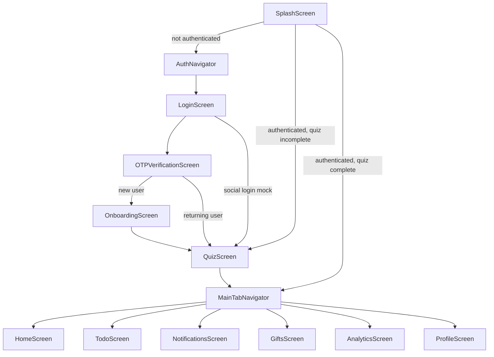

# Implemented Screens

Documentation for all UI screens in the Relationship Care Expo app. Each screen lives under `src/screens/` and is registered in the navigation layer under `src/navigation/`.

---

## Navigation flow

---

## Screen index

| Screen | Route / tab | Doc |
|--------|-------------|-----|
| Splash | `App` → `Splash` | [splash.md](./splash.md) |
| Login | `Auth` → `Login` | [login.md](./login.md) |
| OTP Verification | `Auth` → `OTPVerification` | [otp-verification.md](./otp-verification.md) |
| Setup Profile (Onboarding) | `Auth` → `Onboarding` | [onboarding.md](./onboarding.md) |
| Preference Quiz | `App` → `Quiz` | [quiz.md](./quiz.md) |
| Home | `MainTabs` → `HomeTab` | [home.md](./home.md) |
| To-Do | `MainTabs` → `TodoTab` | [todo.md](./todo.md) |
| Notifications | `MainTabs` → `NotificationsTab` | [notifications.md](./notifications.md) |
| Gift Ideas | `MainTabs` → `GiftsTab` | [gifts.md](./gifts.md) |
| Analytics | `MainTabs` → `AnalyticsTab` | [analytics.md](./analytics.md) |
| Profile | `MainTabs` → `ProfileTab` | [profile.md](./profile.md) |

---

## Shared layout

All scrollable and form screens use [`src/utils/screenLayout.ts`](../../src/utils/screenLayout.ts):

| Token | Value | Usage |
|-------|-------|--------|
| `screenPadding` | 24px (`theme.spacing.lg`) | Content inset on all sides |
| `screenScrollBottomPadding` | 48px (`theme.spacing.xxl`) | Extra bottom space on scroll views |
| `screenLayout.safe` | — | Full-screen wrapper with background |
| `screenLayout.scrollContent` | — | `ScrollView` `contentContainerStyle` |
| `screenLayout.staticContent` | — | Non-scroll centered layouts (e.g. OTP) |

Screens with a native stack header (`OTPVerification`, `Onboarding`) use `SafeAreaView` with `edges={['bottom']}` so top inset is not doubled under the header.

---

## State management

| Area | Store / hook | Screens |
|------|----------------|---------|
| Auth & onboarding | `authSlice`, `useAuth` | Splash, Login, OTP, Onboarding, Profile (logout) |
| Quiz answers | `quizSlice`, `useQuiz` | Splash, Quiz |
| User / relationship | `userSlice` | Onboarding, Profile |
| Partner | `partnerSlice` | Profile |
| Suggestions | `useSuggestions` | Home |
| Todos | `todoSlice`, `useTodos` | To-Do |
| Mood | `useMood` | Home |
| Notifications, gifts, analytics metrics | Local mock data in screen file | Notifications, Gifts, Analytics |

---

## Related documentation

- [Architecture](../architecture.md)
- [Data flow](../data-flow.md)
- [Common components](../components/common.md)
